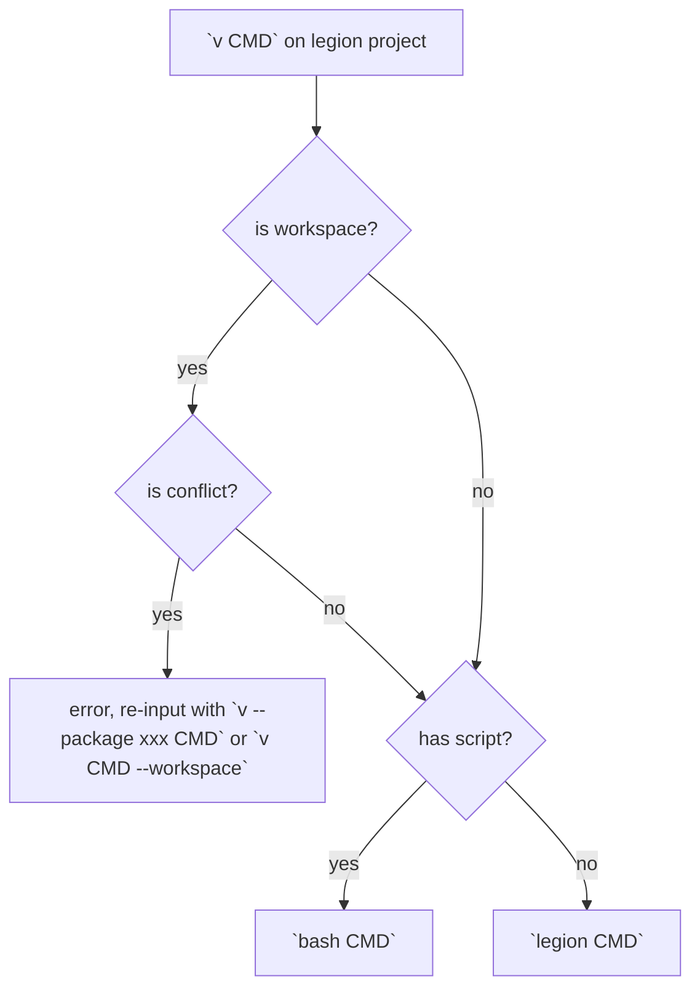

## Prerequisites

- [Git](): Version control system
- [JetBrains IDEA](): Integrated development environment
- [legion](): Valkyrie project build manager
- [vpm](): Valkyrie package manager

## Project Structure

```yaml
root                 # The mono repo root
  - .github/         # GitHub related config
  - .config/         #
    - .legion/       # legion related config
  - packages/        # The package
    - project1
      - legion.json  # legion package
    - project2
      - package.json # non valkyrie package
  - targets/         # output
  - legions.json     # legion workspace config
```

## Package Structure

```yaml
project1             # The mono repo root
  - .github/         # GitHub related config
  - script/          #
    - main.vk/       # vmp run main
  - library/         # expand macro and ready to release
  - source/          # The package
  - test/
  - legion.json      # legion package config
  - readme.json      # readme for the package
```

## `v` Command Execute Logic

`v` is a command dispatcher, `legion` is a project management tool for `valkyrie`.



| short            | full                       |
|:-----------------|:---------------------------|
| `legion run`     | `legion run main --debug`  |
| `legion run app` | `legion run app --debug`   |
| `legion test`    | `legion test * --debug`    |
| `legion bench`   | `legion bench * --release` |

- install/ -> will dispatch
- script/ -> for development, not dispatch


- legion add -> install to local path
- legion install -> install to global path

legion cmd

builtin > global > script > build-dependency

- legion add
- legion install add
- script/add
- legion add-build add

legion run --builtin add
legion run --global add
legion run --script add
legion run --workspace add
legion run --dependency add
legion run --test *
legion run --bench *
legion run --benchmark *

valkyrie-compiler.dll
valkyrie-runtime.dll

```json5
{
    "build-dependency": {
        "@org/xx-cli": {
            version: "*",
            rename: "cmd"
        }
    },
    script: {
        cmd: "xx"
    }
}
```

legion run

dependency build

`legion upgrade valkyrie`


